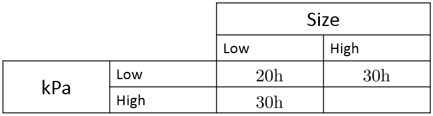

\newcommand{\Var}[1]{\text{Var}\left( #1 \right)}
\newcommand{\E}[1]{E\left( #1 \right)}
\newcommand{\Sample}[1]{#1_1,\ldots,#1_n}
\newcommand{\od}[2]{\overline #1_{#2\cdot}}
\newcommand{\flist}[2]{\{#1_1, #1_2, \ldots, #1_#2\}}
\newcommand{\samp}[2]{#1_1, #1_2, \ldots, #1_#2}
\renewcommand{\bar}[1]{\overline{#1}}
\newcommand{\ve}{\varepsilon}
\newcommand{\bs}[1]{\boldsymbol{#1}}

# midterm 2 information

## Details

2016-03-22 from 15:10 to 16:00 in rooms EX310 and EX320. 

Rooms divided same as last time.

Topics: simple and multiple regression (not including model selection)

No lab next week. Hootan will hold office hours on Tuesday in lieu of a formal tutorial.

I will have a Q&A free-for-all and past test question review in the latter part of today's class.

```{r, echo=FALSE, message=FALSE}
knitr::opts_chunk$set(echo=FALSE)
library(dplyr)
data(trees)
```


```{r}
library(dplyr)
library(ggplot2)
x <- 51:400/100
y <- x^3 - 9*x^2 + 28*x - 24 + rnorm(length(x))
poly_data <- data_frame(x=x, y=y)

poly1 <- lm(y ~ x, poly_data)
poly2 <- lm(y ~ x + I(x^2), poly_data)
poly3 <- lm(y ~ x + I(x^2) + I(x^3), poly_data)
poly4 <- lm(y ~ x + I(x^2) + I(x^3) + I(x^4), poly_data)
poly5 <- lm(y ~ x + I(x^2) + I(x^3) + I(x^4) + I(x^5), poly_data)
```

## Polynomial degree 3 fit 

```{r, fig.height=3, fig.width=3.5, fig.align='center'}
library(broom)
tidy(poly3)
glance(poly3)[1]
```

<div class="columns-2">
```{r, fig.height=3, fig.width=3.5, fig.align='center'}
poly_data %>% 
  ggplot(aes(x=x, y=y)) + geom_point() +
  geom_smooth(method="lm", formula = formula(poly3), se=FALSE, color="red")
```
&nbsp;
```{r, fig.height=3, fig.width=3.5, fig.align='center'}
poly3 %>% 
  ggplot(aes(x=.fitted, y=.resid)) + geom_point()
```
</div>

## Polynomial degree 5 fit 

```{r, fig.height=3, fig.width=3.5, fig.align='center'}
library(broom)
tidy(poly5)
glance(poly5)[1]
```

<div class="columns-2">
```{r, fig.height=3, fig.width=3.5, fig.align='center'}
poly_data %>% 
  ggplot(aes(x=x, y=y)) + geom_point() +
  geom_smooth(method="lm", formula = formula(poly5), se=FALSE, color="red")
```
&nbsp;
```{r, fig.height=3, fig.width=3.5, fig.align='center'}
poly5 %>% 
  ggplot(aes(x=.fitted, y=.resid)) + geom_point()
```
</div>

## "Overall" F tests for degrees 3 and 5 { .build }

```{r}
anova_table <- function(lmo) {
  tidy(anova(lmo)) %>%
    mutate(regr=df==1) %>% 
    group_by(regr) %>% 
    summarize(df=sum(df), sumsq=sum(sumsq)) %>% arrange(-regr) -> lmo_2
  
  lmo_2$ms <- lmo_2$sumsq/lmo_2$df
  names(lmo_2)[1] <- "source"
  lmo_2$source <- c("Regression", "Error")
  lmo_2$F <- c(exp(-diff(log(lmo_2$ms))), NA)
  lmo_2$"p-value" <- pf(lmo_2$F, lmo_2$df[1], lmo_2$df[2], lower.tail = FALSE)
  return(lmo_2)
}

```

Degree 3:

```{r, results='asis'}
library(xtable)
print.xtable(xtable(anova_table(poly3),), "HTML", include.rownames=FALSE)
```

&nbsp;

Degree 5:

```{r, results='asis'}
library(xtable)
print.xtable(xtable(anova_table(poly5),), "HTML", include.rownames=FALSE)
```

## Polynomial example comments { .build }

As expected, the 3rd degree polynomial model is the best model.

Note that 4th and beyond are still perfectly good predictive models!
(Despite some "individual" p-values being large...)

Always remember the correct interpretation of these p-values.

"Overall" F test can show strong evidence of a model even with "individual" p-values small.

These apparent issues are caused (in this case) by powers of $x$ being highly correlated over the range of the data.

## the sample correlation coeffients

Here is a matrix of sample correlation coefficients among the first five powers of $x$ over its range $[`r range(x)[1]`, `r range(x)[2]`]$.

```{r, results='asis', warning=FALSE}
powers <- cbind(x=x, x2=x^2, x3=x)
print.xtable(xtable(cor(cbind(x, x^2, x^3, x^4, x^5)), digits=5), "HTML",
             include.rownames = FALSE, include.colnames = FALSE)
```

## Another higher order term: interaction { .build }

"How long does it take to install a boiler?"

The time is plausibly related to both the size of the boiler and its "rating" (pressure), all else being equal.

Consider the following table:


What would it mean for the missing entry to be: 30, 40, or 50?

## Interaction { .build }

If the effect of $x_1$ on $y$ depends on the value of $x_2$, we
say there is an \textit{interaction} between $x_1$ and $x_2$.

Model:
$$y_i = \beta_0 + \beta_1 x_{1i} + \beta_2 x_{2i} + \beta_3 x_{1i}x_{2i}+\ve_i$$

When $x_1$ increases by one unit, $y$ increases by $\beta_1+\beta_3x_2$ units.

When $x_2$ increases by one unit, $y$ increases by $\beta_2+\beta_3x_1$ units.

## Boiler example

```{r, echo=FALSE}
library(rio)
boiler <- import("boiler.CSV")
boiler %>% 
  lm(hours ~ cap + kPa + cap*kPa, data=.) %>% summary
```

## Boiler (without the interaction term)

```{r, echo=FALSE}
boiler %>% 
  lm(hours ~ cap + kPa, data=.) %>% summary
```

## Dummy variables { .build }

Categorical ("factor") variables can be included in regression models. But they must somehow be encoded as numbers. The way to do this is to use "dummy variables" that take on the values 0 and 1.

If there are $I$ "levels" of the factor variable, you need $I-1$ dummy variables for the encoding. Then include them in the regression model as usual.

